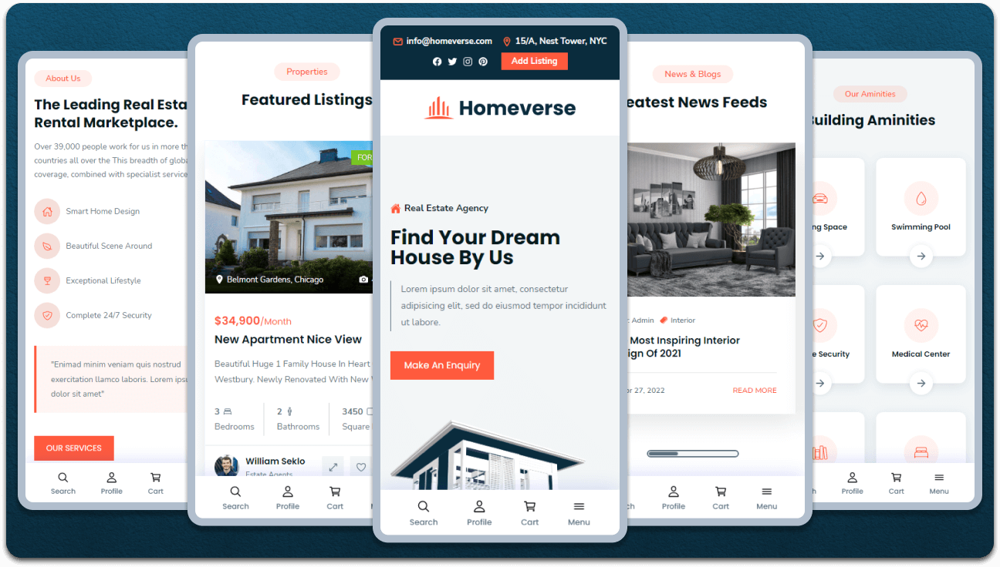

# Homeverse - Modern Real Estate Platform

## Overview
Homeverse is a modern real estate platform that provides a seamless experience for buying, selling, and renting properties. Built with modern web technologies, it offers a rich set of features inspired by industry leaders like Zillow.

## Features
- **Advanced Property Search**: Filter properties by price, location, type, and amenities
- **Home Value Estimator**: Get estimated property values based on market data
- **User Profiles**: Manage your listings, saved properties, and account settings
- **Interactive Property Listings**: Detailed property information with high-quality images
- **Responsive Design**: Seamless experience across all devices
- **Authentication System**: Secure user registration and login
- **Property Management**: List, edit, and manage property listings
- **Mortgage Calculator**: Calculate monthly payments and loan terms

## Tech Stack
- **Frontend**: HTML5, CSS3, JavaScript
- **Styling**: Custom CSS with responsive design
- **Icons**: Ionicons
- **Images**: Optimized property and UI images
- **Fonts**: Nunito Sans, Poppins

## Getting Started

### Prerequisites
- Web browser (Chrome, Firefox, Safari, or Edge recommended)
- Text editor (VS Code, Sublime Text, etc.)
- Basic understanding of HTML, CSS, and JavaScript

### Installation
1. Clone the repository:
   ```bash
   git clone https://github.com/yourusername/homeverse.git
   ```
2. Navigate to the project directory:
   ```bash
   cd homeverse
   ```
3. Open the project in your preferred text editor
4. Launch the application by opening `index.html` in your web browser

## Project Structure
```
homeverse/
├── frontend/
│   ├── assets/
│   │   ├── css/
│   │   ├── images/
│   │   └── js/
│   ├── index.html
│   └── other HTML files
└── README.md
```

## Contributing
1. Fork the repository
2. Create your feature branch (`git checkout -b feature/AmazingFeature`)
3. Commit your changes (`git commit -m 'Add some AmazingFeature'`)
4. Push to the branch (`git push origin feature/AmazingFeature`)
5. Open a Pull Request

## License
This project is licensed under the MIT License - see the LICENSE file for details.

## Acknowledgments
- Design inspiration from modern real estate platforms
- Icons provided by Ionicons
- Fonts from Google Fonts

<div align="center">
  
  
  
  
[](https://twitter.com/intent/follow?screen_name=codewithsadee_)
  [](https://youtu.be/6HZ4nZmU_pE)

  <br />
  <br />
  
  

  <h2 align="center">Homeverse - Real estate website</h2>

  Homeverse is fully responsive Real estate website, <br />Responsive for all devices, built using HTML, CSS, and JavaScript.

  <a href="https://codewithsadee.github.io/homeverse/"><strong>➥ Live Demo</strong></a>

</div>

<br />

### Demo Screeshots




### Prerequisites

Before you begin, ensure you have met the following requirements:

* [Git](https://git-scm.com/downloads "Download Git") must be installed on your operating system.

### Run Locally

To run **Homeverse** locally, run this command on your git bash:

Linux and macOS:

```bash
sudo git clone https://github.com/codewithsadee/homeverse.git
```

Windows:

```bash
git clone https://github.com/codewithsadee/homeverse.git
```